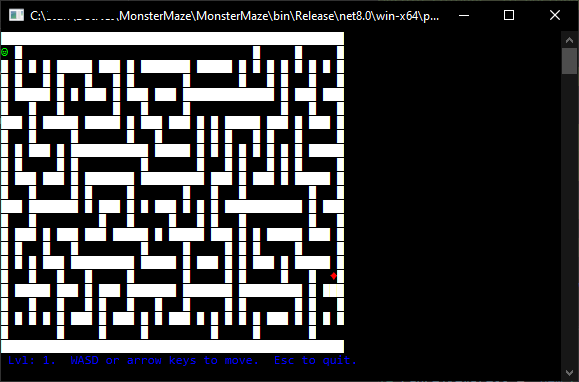

# Monster Maze

A console maze game written in C# .NET 8.0.



The player ("P") has to get from the top left corner, to the bottom right of the maze (the exit).   At the same time, a monster ("M") is chasing the player.   The player must avoid the monster and not get caught.

To run: ```dotnet build; dotnet run```
